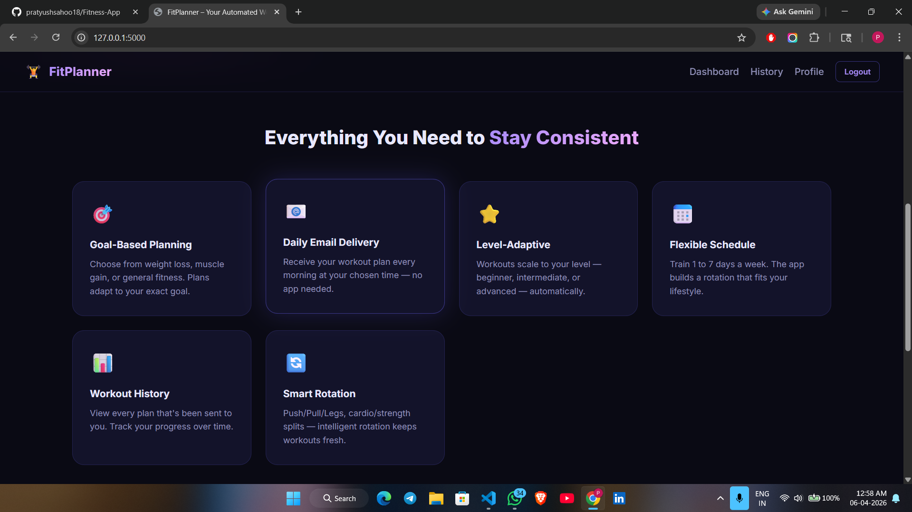
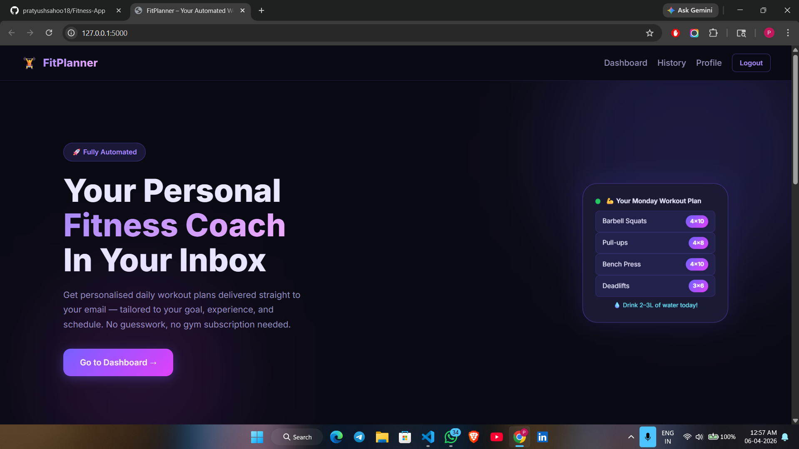
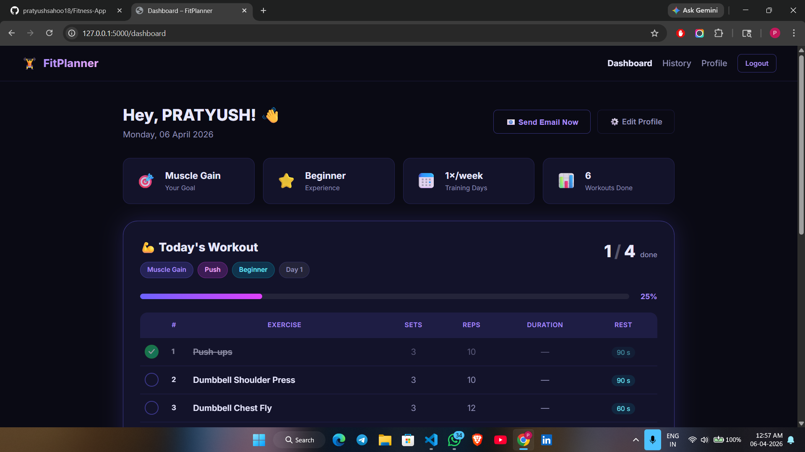
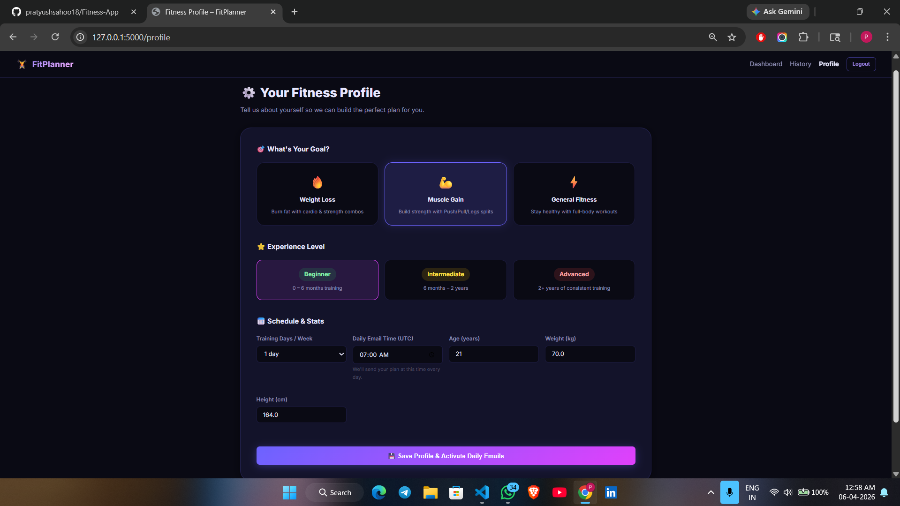

# 🏋️ FitPlanner – Automated Workout Planner

A beginner-friendly **Flask-based fitness web app** that generates personalized daily workout plans and automatically emails them to users — helping maintain consistency without manual effort.

---

## 🚀 Features

* ✅ Personalized workout plans (based on goal & experience)
* ✅ Daily automated email delivery (APScheduler)
* ✅ Clean dashboard with progress tracking
* ✅ One-click “Send Email Now” feature
* ✅ Workout history tracking
* ✅ Beginner-friendly UI (dark theme)

---

## 🛠 Tech Stack

* **Backend:** Python, Flask
* **Database:** SQLite (SQLAlchemy ORM)
* **Email:** Flask-Mail (Gmail SMTP)
* **Scheduler:** APScheduler
* **Frontend:** HTML, CSS, JavaScript

---

## 📁 Project Structure

fitness_app/
│
├── app.py
├── config.py
├── extensions.py
├── models.py
├── routes.py
├── workout_engine.py
├── email_sender.py
├── scheduler.py
│
├── templates/
├── static/
├── requirements.txt

---

## ⚙️ Setup Instructions

### 1️⃣ Clone the repository

```bash
git clone https://github.com/pratyushsahoo18/Fitness-App.git
cd Fitness-App
```

### 2️⃣ Create virtual environment

```bash
python -m venv venv
venv\Scripts\activate
```

### 3️⃣ Install dependencies

```bash
pip install -r requirements.txt
```

### 4️⃣ Configure environment variables

Create a `.env` file:

```env
MAIL_USERNAME=your_email@gmail.com
MAIL_PASSWORD=your_app_password
MAIL_DEFAULT_SENDER=your_email@gmail.com
```

---

### 5️⃣ Run the app

```bash
python app.py
```

---

### 6️⃣ Open in browser

👉 http://127.0.0.1:5000

---

## 📸 Screenshots

### 🏠 Home Interface


### 📊 Dashboard


### 🧠 Workout Progress


### 👤 Profile Page


---

## 🧠 How It Works

* Generates workout plans dynamically
* Stores user data in SQLite
* Uses scheduler to send emails daily
* Tracks workout completion progress

---

## 🔥 Future Improvements

* Add user authentication with Google OAuth
* Deploy online (Render / Railway)
* Add charts for progress tracking
* Add more workout variations

---

## 👨‍💻 Author

**Pratyush Sahoo**

* GitHub: https://github.com/pratyushsahoo18

---

## ⭐ Show Your Support

If you like this project, give it a ⭐ on GitHub!
